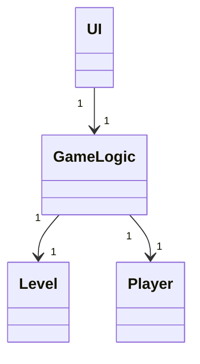
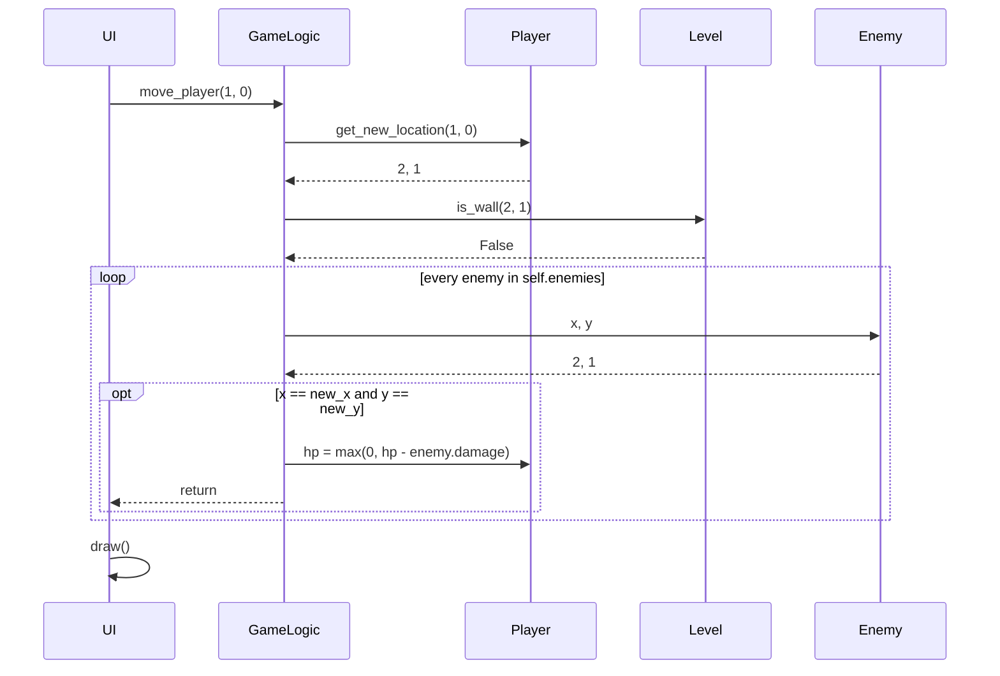

```mermaid
    classDiagram
        class UI
        class GameLogic
        class Level
        class Player

        UI "1" --> "1" GameLogic
        GameLogic "1" --> "1" Level
        GameLogic "1" --> "1" Player
```

## Sequence Diagram for moving player to enemy

```mermaid
    sequenceDiagram
        UI->>GameLogic: move_player(1, 0)
        GameLogic->>Player: get_new_location(1, 0)
        Player-->>GameLogic: 2, 1
        GameLogic->>Level: is_wall(2, 1)
        Level-->>GameLogic: False
        loop every enemy in self.enemies
            GameLogic->>Enemy: x, y
            Enemy-->>GameLogic: 2, 1

            opt x == new_x and y == new_y
                GameLogic->>Player: hp = max(0, hp - enemy.damage)
                GameLogic-->>UI: return
            end
        end

        UI->>UI: draw()
```
