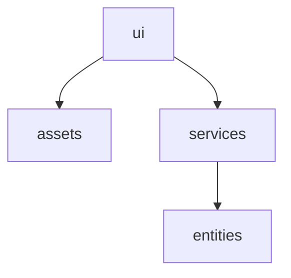
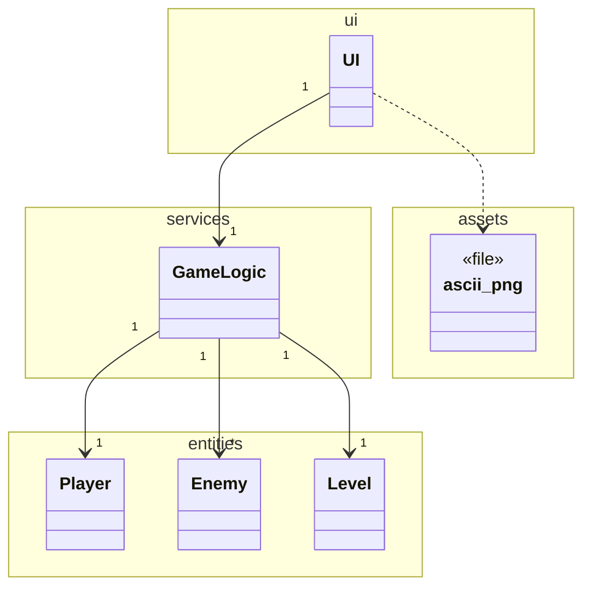
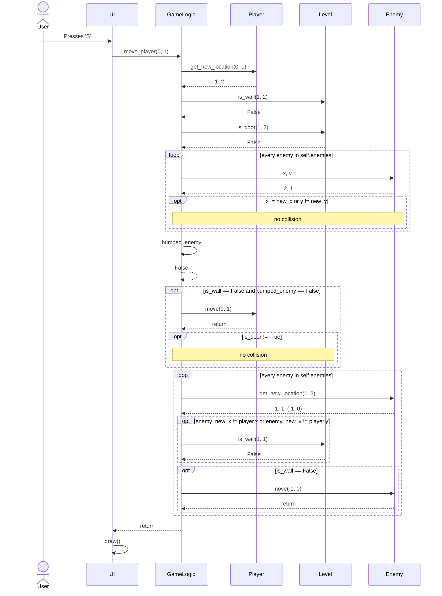
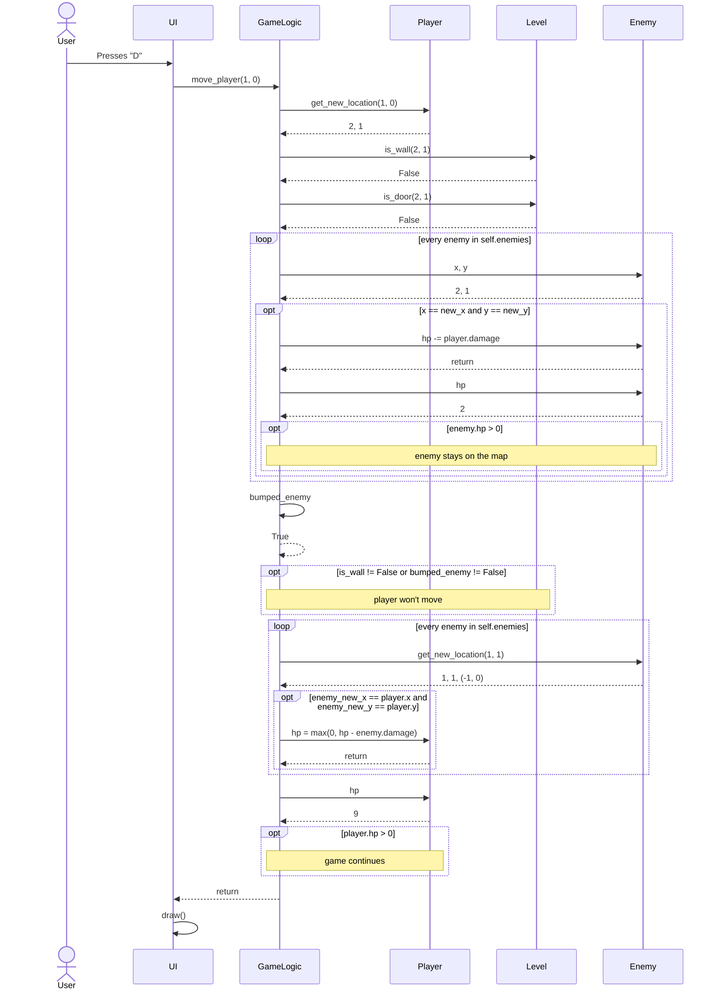

# Arkkitehtuurikuvaus

## Rakenne

Sovelluksen rakenne noudattaa kolmitasoista kerrosarkkitehtuuria. Koodin pakkausrakenne on seuraava:

Pakkaus ui sisältää käyttöliittymästä vastaavan koodin. Pakkaus services sisältää sovelluslogiikasta vastaavan koodin ja entities sisältää tietokohteita edustavat luokat. Assets sisältää pelin visuaalisen esittämisen vaatimat mediatiedostot.

## Käyttöliittymä

Käyttöliittymä on eriytetty täysin sovelluslogiikasta. Siitä vastaa UI-luokka, joka hyödyntää Pygame-kirjastoa.

Käyttöliittymä vastaa:

    - Näppäimistösyötteiden lukemisesta

    - Pelitilan (kartta, hahmot, lokitekstit) piirtämisestä ruudulle

Käyttöliittymä ei itse muokkaa pelin tilaa, vaan kutsuu ainoastaan sovelluslogiikan (GameLogic) metodeja, kuten move_player(). Kun sovelluslogiikka on päivittänyt tilan, UI kutsuu omaa draw()-metodiaan renderöidäkseen uuden tilanteen ruudulle.

## Sovelluslogiikka

Sovelluksen loogisen tietomallin muodostavat luokat Player, Enemy ja Level.

Varsinaisesta sovelluslogiikasta vastaa GameLogic-luokka, joka tarjoaa käyttöliittymälle metodit pelin tilan muokkaamiseen.

GameLogic käyttää näiden toiminnallisuuksien toteuttamiseen entities-pakkauksen luokkia. Se tarkistaa siirtojen laillisuuden ja päivittää niiden pohjalta pelitilaa.

Ohjelman osien väliset suhteet selviävät seuraavasta luokka-/pakkauskaaviosta:

## Päätoiminnallisuudet

Kuvataan seuraavaksi sovelluksen toimintalogiikkaa sekvenssikaavioiden avulla.

### Pelaajan liikkuminen tyhjään ruutuun

Kun pelaaja valitsee liikkua kartalla alaspäin ruutuun, joka on tyhjä lattiaruutu ilman lähettyvillä olevia vihollisia, maailma päivittyy seuraavasti:

Metodi move_player löytää ensin pelaajan uuden hypoteettisen lokaation. Se tarkastaa ennen liikkumista, törmääkö pelaaja vihollisiin tai seinään ja todettuaan että näin ei ole, liikuttaa pelaajaa. Seuraavaksi se tarkastaa kävelikö pelaaja oven päälle, ja todettuaan että näinkään ei ole, jatkaa eteenpäin. Metodi hakee vihollisten uudet hypoteettiset lokaatiot ja tarkistaa ennen liikkumista, törmäävätkö nämä pelaajaan tai seiniin. Todettuaan että näin ei ole, se liikuttaa näitä. Lopuksi UI-luokka piirtää päivittyneen tilanteen.

## Pelaajan liikkuminen vihollisen ruutuun

Kun pelaaja valitsee liikkua kartalla oikealle ruutuun, jossa on parhaillaan vihollinen, maailma päivittyy seuraavasti:

Metodi move_player löytää ensin pelaajan uuden hypoteettisen lokaation. Se tarkastaa ennen liikkumista, törmääkö pelaaja vihollisiin tai seinään ja todettuaan että pelaaja törmää viholliseen, se vähentää viholliselta HP:ta ja tarkastaa kuoleeko vihollinen. Pelaaja ei tällöin liiku. Metodi hakee vihollisten uudet hypoteettiset lokaatiot ja tarkistaa ennen liikkumista, törmäävätkö nämä pelaajaan tai seiniin. Todettuaan että vihollinen törmää pelaajaan, se vähentää pelaajalta HP:ta ja tarkastaa kuoleeko pelaaja. Vihollinen ei tällöin liiku. Lopuksi UI-luokka piirtää päivittyneen tilanteen.
