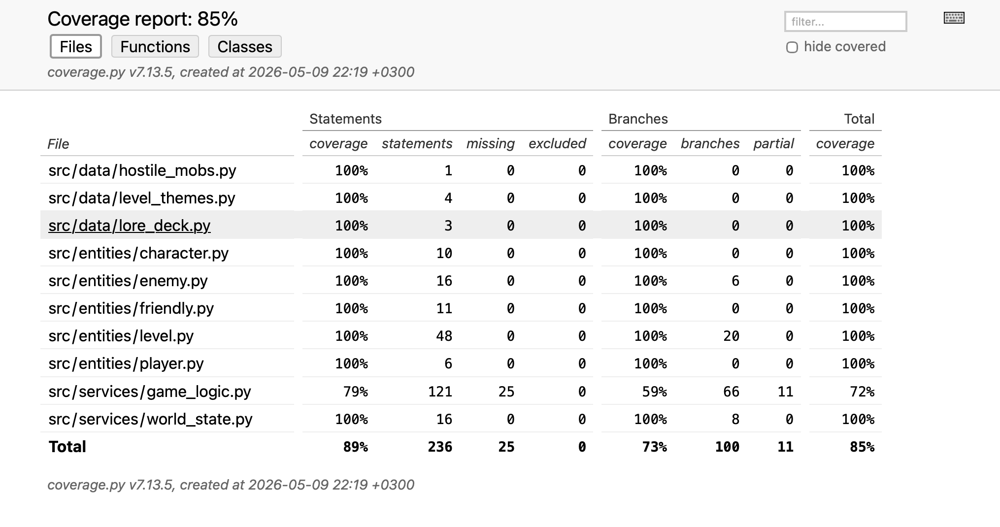

# Testausdokumentti

Ohjelmaa on testattu sekä automatisoiduin yksikkö- että integraatiotestein käyttäen Pythonin unittest-kirjastoa. Lopullinen testaus on suoritettu manuaalisesti järjestelmätason testeillä.

## Yksikkö- ja integraatiotestaus

### Sovelluslogiikka

Sovelluksen ydinlogiikasta vastaavaa GameLogic-luokkaa testataan TestGameLogic-testiluokalla. Pelin vahvasta satunnaisesta luonteesta johtuen testauksessa on hyödynnetty riippuvuuksien injektointia.

GameLogic-oliolle injektoidaan testeissä kovakoodattuja test_theme-sanakirjoja sekä Level-, Player-, Enemy-, Friendly- ja WorldState-olioita.

### Entiteetit

Pelin entiteettien (Enemy, Friendly, Level, Player) toimintalogiikkaa testataan omissa testiluokissa. Esimerkiksi TestLevel-luokassa varmistetaan, että koordinaattien rajatarkistukset toimivat oikein ja huonegeneraattori toimii oikein kaikissa eri ilmansuunnissa. Tällaisessa tilanteissa satunnaisuutta hallitaan unittest.mock.patch-työkalulla. Myös data-kerrosta testataan sekä osana sekä sovelluslogiikan että entiteettien testejä korvaamalla oikeat datalistat tilapäisillä testidatoilla.

### Testikattavuus

Käyttöliittymäkerros sekä sovelluksen käynnistävä pääkoodi on jätetty pois testikattavuudesta. Näiden ulkopuolinen haaraumakattavuus on 73%.

Keskeisimäpänä testaamatta jäivät suurimmaksi osaksi esineiden ja friendlyjen lisäämismekaniikka GameLogicissa, eli karkeasti yleistettynä tarinan proseduraalisen generoinnin moottorin testaaminen.

## Järjestelmätestaus

Sovelluksen manuaalinen järjestelmätestaus.

### Asennus

Sovellus on asennettu, alustettu ja käynnistetty macOS- ja Linux-ympäristöissä onnistuneesti käyttöohjeen esittämällä tavalla.

### Toiminnallisuudet

Kaikki vaatimusmäärittelyn sekä käyttöohjeen esittämät toiminnallisuudet on testattu manuaalisesti toimiviksi.

## Sovellukseen jääneet laatuongelmat

- Sovellus ei ota tällä hetkellä huomioon asianmukaisella virheilmoituksella tilanteita, joissa esim. data-kerros puuttuisi, vaan kaatuu käynnistettäessä.

- Tapahtumaloki ei tue tällä hetkellä erityisen pitkiä dialogeja ja sitä pitäisikin muuttaa skaalattavuuden mahdollistamiseksi

- Käyttöliittymä ei välttämättä käyttäydy oikein jos ikkunan kokoa muutettaisiin
