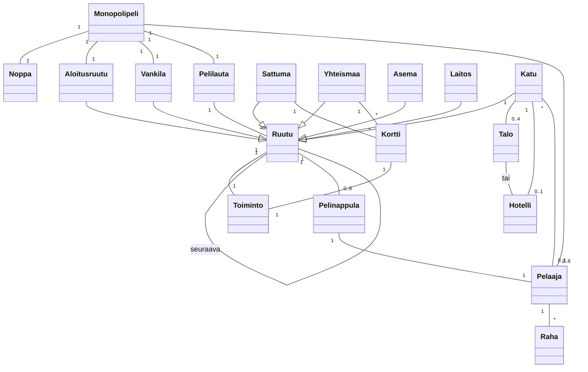

## Monopoli, alustava luokkakaavio

```mermaid
 classDiagram
    Monopolipeli "1" -- "2" Noppa
    Monopolipeli "1" -- "1" Aloitusruutu
    Monopolipeli "1" -- "1" Vankila
    Monopolipeli "1" -- "1" Pelilauta
    Pelilauta "1" -- "40" Ruutu
    Aloitusruutu --|> Ruutu
    Vankila --|> Ruutu
    Sattuma --|> Ruutu
    Yhteismaa --|> Ruutu
    Asema --|> Ruutu
    Laitos --|> Ruutu
    Katu --|> Ruutu
    Katu "1" -- "0..4" Talo
    Katu "1" -- "0..1" Hotelli
    Talo -- Hotelli : tai
    Katu "*" -- "0..1" Pelaaja
    Ruutu "1" -- "1" Toiminto
    Sattuma "1" -- "*" Kortti
    Yhteismaa "1" -- "*" Kortti
    Kortti "1" -- "1" Toiminto
    Ruutu "1" -- "1" Ruutu : seuraava
    Ruutu "1" -- "0..8" Pelinappula
    Pelinappula "1" -- "1" Pelaaja
    Pelaaja "2..8" -- "1" Monopolipeli
    Pelaaja "1" -- "*" Raha
```
