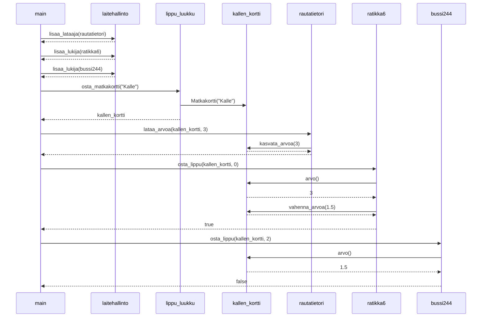

## HSL, sekvenssikaavio

```mermaid
sequenceDiagram
    main->>laitehallinto: lisaa_lataaja(rautatietori)
    laitehallinto-->>main:
    main->>laitehallinto: lisaa_lukija(ratikka6)
    laitehallinto-->>main:
    main->>laitehallinto: lisaa_lukija(bussi244)
    laitehallinto-->>main:
    main->>lippu_luukku: osta_matkakortti("Kalle")
    lippu_luukku->>kallen_kortti: Matkakortti("Kalle")
    lippu_luukku-->>main: kallen_kortti
    main->>rautatietori: lataa_arvoa(kallen_kortti, 3)
    rautatietori->>kallen_kortti: kasvata_arvoa(3)
    kallen_kortti-->>rautatietori:
    rautatietori-->>main:
    main->>ratikka6: osta_lippu(kallen_kortti, 0)
    ratikka6->>kallen_kortti: arvo()
    kallen_kortti-->>ratikka6: 3
    ratikka6->>kallen_kortti: vahenna_arvoa(1.5)
    kallen_kortti-->>ratikka6:
    ratikka6-->>main: true
    main->>bussi244: osta_lippu(kallen_kortti, 2)
    bussi244->>kallen_kortti: arvo()
    kallen_kortti-->>bussi244: 1.5
    bussi244-->>main: false
```
